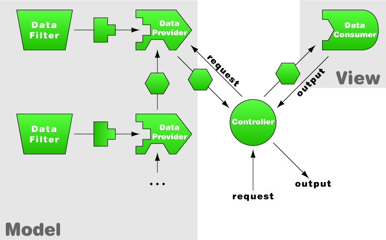

.. ==================================================
.. FOR YOUR INFORMATION
.. --------------------------------------------------
.. -*- coding: utf-8 -*- with BOM.

.. include:: ../../Includes.txt

.. _fundamentals-main-concept:

The main concept
----------------

The basic idea is the following: there can exist a number of tools capable of extracting data
from any number of sources, be it the TYPO3 CMS database, external databases or other formats
(plain text files, RSS feeds, etc.). Those tools are expected to provide that data in a
standardized data structure (SDS). If the data comes from the TYPO3 CMS database,
the tools are expected to have done a clean work as far as handling the deleted flag,
the enable fields and the language overlays are concerned (and – in an ideal world –
also the workspace overlays). These tools are called Data Providers (or simply Providers).

There can be more than a single type of standardized data structure, but their number
must be kept very low so that interoperability remains easy to implement.
At the moment two SDS types exist: full set of records (recordset) and list of primary keys (idlist).

This standardized data is then used by output engines called by the controller.
Each output engine is capable of handling one type of SDS. These output engines are called Data Consumers
(or simply Consumers). Their goal is to produce some kind of output with the SDS they have received.
In particular, this can be HTML code to be displayed in the TYPO3 CMS frontend.

The Data Providers can receive input from other Data Providers to rework the data.
A Data Provider can also receive input from a Data Filter (or simply Filter).
This is another kind of standardized structure that describes filters to apply to the data,
as well as sorting and capping (limit) parameters.

This architecture can be represented roughly with the following schema:

