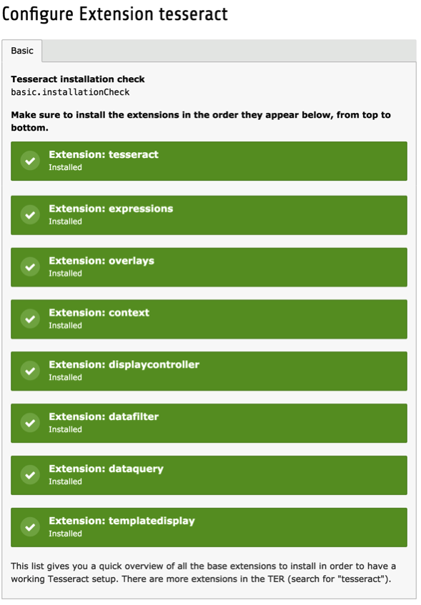

.. ==================================================
.. FOR YOUR INFORMATION
.. --------------------------------------------------
.. -*- coding: utf-8 -*- with BOM.

.. include:: ../Includes.txt

.. _installation:

Installation
============

As was described above the Tesseract Project is not a single extension but a whole suite of them.

Refer to the manual of each extension for specific installation details.

Installing "tesseract" alone does nothing as this extension only provides this documentation
and a number of bases classes used by the other extensions.

The extension configuration screen provides a quick way to check if the main extensions
that make up Tesseract are installed. Tesseract is of a modular nature.
This means that you may perfectly run without some of the suggested extensions.
You may also have other extensions installed, but which won't appear in the this check screen.

A typical screen may look like the one below. **Note that extensions must be installed
in the exact order in which they are presented in this screen!**

.. _installation-compatibility-issues:

Compatibility issues
--------------------

The latest version of most Tesseract components require TYPO3 CMS 7 LTS
and PHP 5.5 or more.

.. _installation-upgrading-to-version-200:

Upgrading to version 2.0.0
--------------------------

The main change in version 2.0.0 is the switch to namespaced classes.
This will require adaptations for all custom components. An equivalence
table is available in :ref:`Appendix A <appendix-a>` for helping
with migration.
